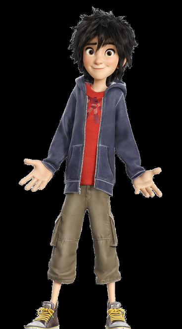
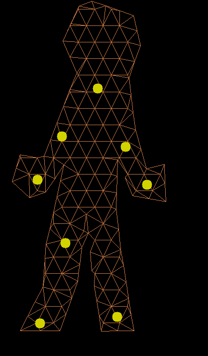
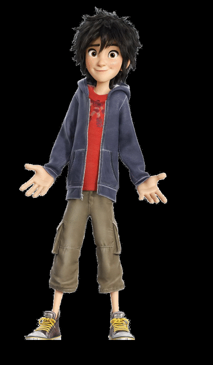
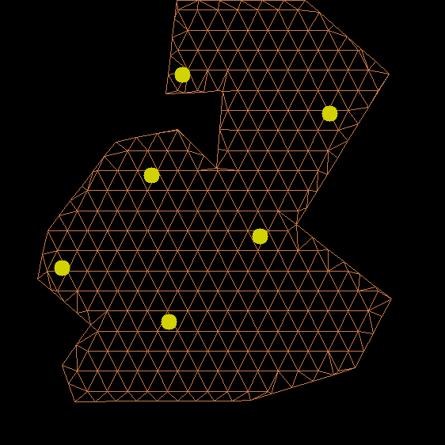
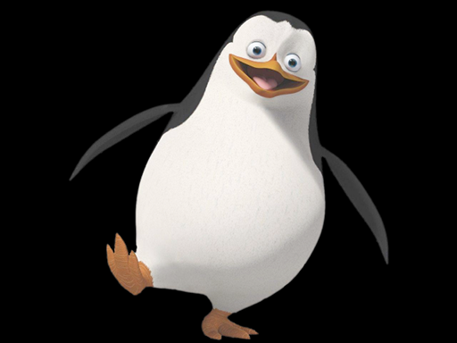
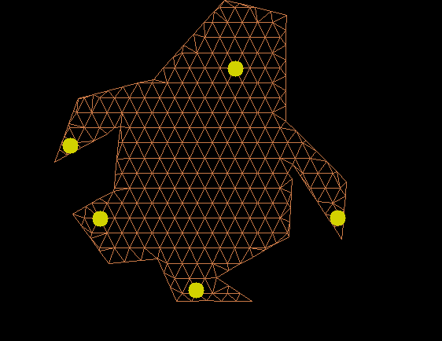
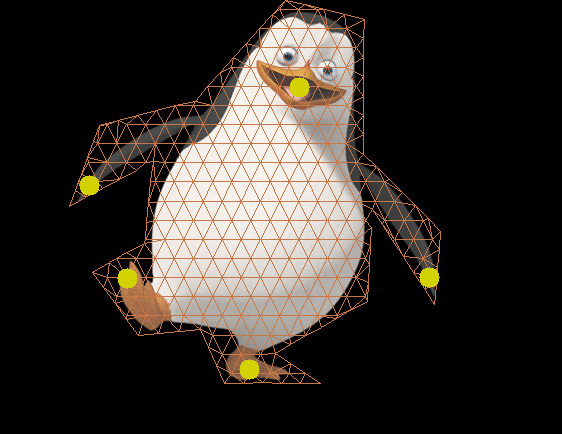
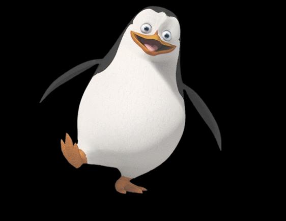

# As Rigid As Possible Shape Manipulation

This is a project to reproduce as-rigid-as-possible shape manipulation, described in [Igarashi05](documents/Igarashi-2005-ASM.pdf),
implemented according to [Igarashi09](documents/takeo_jgt09_arapFlattening.pdf).

## How to run
The code is provided in Python 2.7 file (very minor changes needed for Python 3). The following libraries are required:

    numpy
    shapely
    opencv
    
To run the demo, type the following:

    python animating_as_rigid_as_possible_shape_manipulation.py
    
This creates 30 animation frames for 3 different cartoons you can assemble to animated GIFs:

**Cartoon 1:**

**Cartoon 2:**

**Cartoon 3**

## Making animations

To make your own animation, you need an image with a clean background and to provide contours
of a character intended to be animated. See the code at the bottom of [source](animating_as_rigid_as_possible_shape_manipulation.py)
on how to use it ('boundary' variable).

For the sake of simplicity, movement defines two sets of handles, initial and final ones ('initial_handles'
and 'final_handles' variables). It then linearly interpolates between initial and final handle positions for animation.

Handles can be placed arbitrarily inside boundary; for coordinates inside triangles barycentric coordinates
are computed.

## License

This source is released under [GNU Affero General Publick Licence v3](https://www.gnu.org/licenses/agpl-3.0.en.html). If
you intend to incorporate this code in your own application or SaaS product you are required to release
full source code of your app to your users.

For commercial licence without this limitation please contact me directly.
